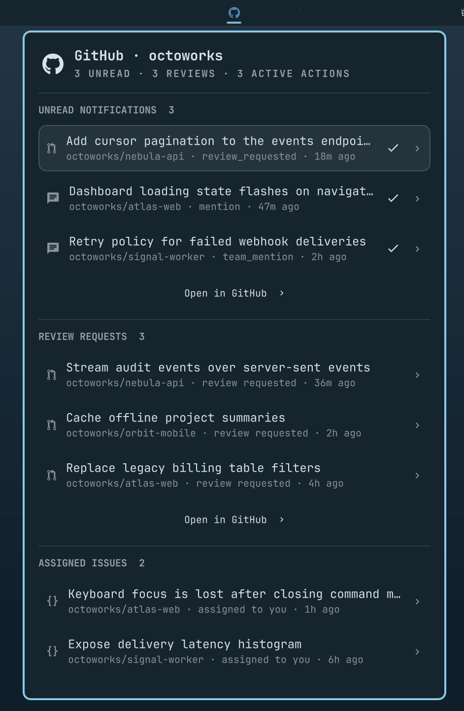

# Omarchy GitHub

Your GitHub work, directly in the Omarchy bar.

**Omarchy GitHub** turns the Octocat in your bar into a fast, keyboard-friendly command center for everything that needs your attention—without keeping another browser tab open.



## Everything waiting for you, in one panel

The dashboard is ordered by urgency so the most actionable work appears first:

- **Unread notifications** — open the related thread or mark it read in place
- **Review requests** — see pull requests waiting on your review
- **Assigned issues** — keep track of open issues assigned to you
- **Active GitHub Actions** — monitor queued, pending, requested, waiting, and running workflows
- **Recent workflow failures** — jump directly to failed, timed-out, or action-required runs
- **Owned repositories** — browse every repository you own with open issue, open PR, star, and active workflow counts

Repository search, metric filters, and sorting make even large GitHub accounts manageable. Filter to repositories with issues, PRs, stars, or active Actions, then sort by the metric that matters.

## Highlights

- Native Omarchy Quattro bar widget with an Octocat icon
- Compact previews that keep busy accounts readable
- Direct links to notifications, pull requests, issues, workflow runs, and repositories
- One-click notification mark-as-read, confirmed by GitHub before removal
- Complete paginated repository and notification fetching
- Configurable Actions scanning with bounded concurrency
- Graceful partial results when an endpoint or repository is unavailable
- Explicit logged-out, rate-limited, missing CLI, loading, and error states
- Mouse and keyboard navigation throughout
- Uses the existing GitHub CLI credential store—no token configuration or secret files

## Requirements

- Omarchy Quattro with shell plugin support
- [`gh`](https://cli.github.com/) on `PATH`
- [`jq`](https://jqlang.github.io/jq/)
- A Nerd Font; Omarchy includes one by default

Authenticate GitHub CLI before installing:

```bash
gh auth login
gh auth status
```

The `notifications` scope is required to read notifications and mark threads read. The `repo` scope may be required for private repositories, review requests, assigned issues, and Actions:

```bash
gh auth refresh -h github.com -s notifications -s repo
```

Omarchy GitHub delegates authentication entirely to `gh`. It does not read, copy, log, or persist your GitHub token.

## Install

Install directly from GitHub and enable the widget:

```bash
omarchy plugin add https://github.com/robzolkos/omarchy-github.git --enable
```

The widget defaults to the right side of the bar. To choose its position interactively:

```bash
omarchy bar move robzolkos.github
```

Confirm the installation:

```bash
omarchy plugin list | grep robzolkos.github
```

### Update

```bash
omarchy plugin update robzolkos.github
```

If your Omarchy version only supports updating all third-party plugins:

```bash
omarchy plugin update
```

### Remove

```bash
omarchy plugin remove robzolkos.github
```

## Controls

| Input | Action |
| --- | --- |
| Left click Octocat | Open or close the dashboard |
| Right or middle click Octocat | Refresh |
| Click a row | Open it on GitHub |
| Check button on a notification | Mark the thread read after GitHub confirms it |
| `j` / `k` or arrow keys | Move through visible rows |
| `Enter` / `Space` | Open the highlighted row |
| `m` | Mark the highlighted notification read |
| `/` | Focus repository search |
| `r` | Refresh |
| `Escape` in search | Clear search and return to row navigation |
| `Escape` elsewhere | Close the panel |

Activity sections show five items initially and expand to a bounded list of 25. **Open in GitHub** takes you to the corresponding complete GitHub view where one is available.

## Repository dashboard

Every owned repository includes:

- Open issue count
- Open pull request count
- Star count
- Active Actions count, when present
- Last-updated time

Use the filter chips to show all repositories or only repositories with a non-zero issue, PR, star, or active Actions count. Sort by update time, name, or any metric. Search always runs against the complete fetched repository list, even when rendered rows are capped.

## Settings

Configure the widget through Omarchy's bar widget settings:

- Refresh interval
- Include archived repositories
- Include forks
- Include review requests and issues from archived repositories
- Include review requests on drafts
- Maximum displayed repositories
- Actions scan mode: off, recent repositories, or all repositories
- Number of recent repositories to scan
- Actions request concurrency
- Failed Actions time window and maximum result count

The defaults deliberately balance freshness and GitHub API usage. Accounts that need exhaustive workflow monitoring can select **All repositories**.

Review requests and assigned issues from archived repositories are hidden by default because archived repositories are read-only. Review requests on draft pull requests are also hidden by default, while teams that use drafts for early feedback can include them. Each behavior has its own setting.

## Local development

From an existing checkout, validate and test the plugin:

```bash
omarchy plugin validate .
tests/helper-test.sh
```

Install that checkout for local iteration:

```bash
omarchy plugin add "$PWD" --enable
```

The shell watches local plugin files, making QML iteration fast.

## How it works

`Service.qml` schedules an executable helper, `omarchy-github-fetch`, which calls GitHub exclusively through `gh api` and processes responses with `jq`.

- GraphQL retrieves every owned repository and exact aggregate counts.
- REST retrieves notifications and workflow runs.
- GitHub issue search retrieves review requests and assigned issues.
- Status-specific, paginated Actions requests prevent busy repositories from hiding active runs.
- Completed runs are server-bounded to the configured failure window.
- Independent requests allow successful sections to remain available when one endpoint fails.

Run the helper directly to inspect its JSON output:

```bash
./omarchy-github-fetch --action-scan recent --action-repo-limit 15 | jq
```

## License

MIT
